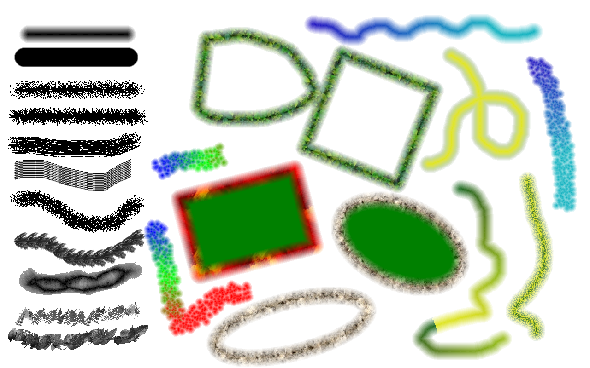
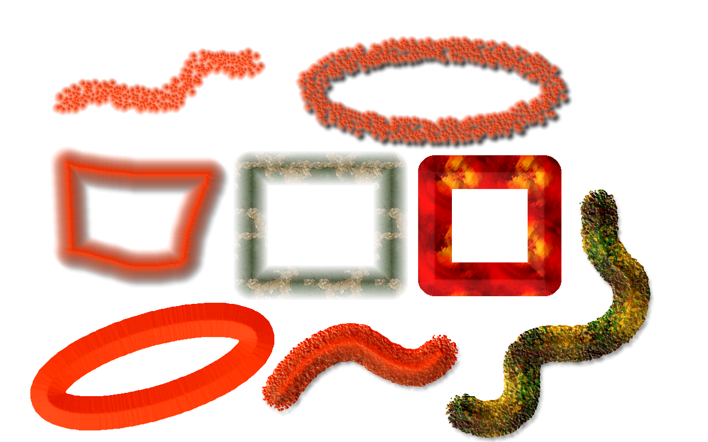
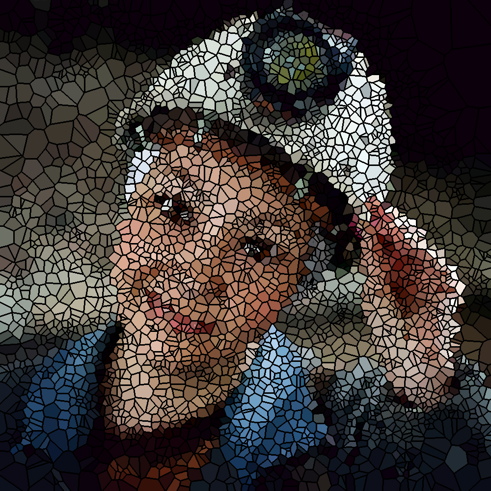

# SigmaPi Engine
## Drawing and Image Processing Engine   
SigmaPi Engine or shortly spEngine is library (DLL) mainly intended to be used with Embarcadero C++/Delphi on Windows platform.
This library is main drawing and image processing engine of Pixopedia XE painter and image editor:
https://www.sigmapi-design.com/pixopedia/.

Library is written in Embarcadero C++ 10.1. Berlin, except one assembly function (fast_ftol) for fast double to int conversion.

Besides native code, engine also uses a subset of Intel® IPP (Intel® Integrated Performance Primitives), packed in custom DLL. Using IPP is optional and if engine can not find ipp_custom.dll all APIs involving IPP processing routines will return false, indicating IPP is not installed. With little modification you can use a complete set of IPP DLLs instead of single custom DLL. Tools for creating cusom IPP DLL can be found in ipp_custom_def directory. 

To be able to call spEngine APIs from some host drawing program, you must either define spHostApp variable in your host prorgram (`#define spHostApp`) or make a copy of spEngineDLL.h and delete/comment `#define spHostApp` and it's associated `#endif`. In later case, you don't have to define spHostApp in your main program.  

## Delphi Developers
To be able to use spEnigne.DLL from Delphi, API prototypes in spEngineDLL.h must be converted to pas file, as well as structure and typedefs in spGlobals.h. Before converting spEngineDLL.h you can comment or delete `#define spHostApp` and it's associated `#endif`.  

## Supported image formats
Similar to LIPS engine (https://github.com/spetric/Lips), spEngine supports RGB24 bitmap/image container. Only width, height, scanline alignement and pointer to image buffer are passed to spEngine. Also, spEngine supports RGB24 images with separated alpha channel. Support for RGBA32 can be added as well, but currently it's not supported.  

## Drawing and Image processing capabilites
### Graphics primitives
Free hand drawing, line, polyline, polygon, spline, closed spline, rectangle, ellipse, square, circle. All closed shapes can be rotated.
Strokes can be filtered, jittered, bumped (simulating 3D using height field). Stroke envolopes and stroke scratchings are supported.
### Brushes
Neon, solid, hair, star, mesh, parallel, spray, stamp (PNG brushes), pump, CML. Brush can be changed on the fly. Brush intensity and size variations are supported.
### Arithmetics
Drawing can be performd using various arithmetic and boolean operations. Drawing also can be perform using grayscale masks. Contour clipping is also supported.
### Color schemes
Various color schemes are supported: primary color, secondary color, mixed primary/secondary, color palette, color texture, background tiles, clone brushing.
### Image warping
spEngine supports a big collection of image warping algorithms.
### Image filtering-processing
Various native 3x3 filters, IPP filters (blur, median, bilateral, morphological filters, Gaussian, Laplacian, etc...). Voronoi diagram and Daulanay triangulation is supported. IPP color twisting and convolution (cross-correlation), histogram, remaping, affine, bilinear and perspective transformations, etc... Note: all filtes can be applied on complete image, on some ROI, through the grayscale mask and under the brush stroke (including free hand strokes).
### Undo/redo
Creating undo/redo buffer is also supported. Host program can fetch and store current undo buffer together with undo buffer ROI.

## Porting engine to other C++ plaforms
With some code changes, spEngine can be ported to some other C++ platform/compiler, such as Microsoft Visual C++. What needs to be converted:
1. #include <Types.hpp> - only because of Byte type definition. You can use typedef unsigned char Byte.
2. TList object container used to store brushes (brush bucket) can be replaced with std::vector or some other object list.
3. Pointers to methods, for instance: `typedef bool (__closure *TWMouseDown)(TShiftState, int, int);` (Embarcadero C++), should be converted to, let's say: `bool (spEngineWrapper:: *TWMouseDown)(TShiftState, int, int);` (MSVC). Note: TShiftState is a set of mouse states: `(ssShift, ssAlt, ssCtrl, ssLeft, ssRight, ssMiddle, ssDouble) TShiftState;`. Currently, spEngine does not use it, so you can pass an empty set of type TShiftState.    
4. TThread should be converted to std::thread or similar threading class.

## Demo with source code
Demo with source code (Delphi and C++) can be downloaded from: https://sigmapi-design.com/archive/spEngine.zip.
However, this is a very old version of spEnigne (0.6) without IPP support. Anyway, you can get a picture on how to use spEnigne APIs.

## Prebuild spEnigne.dll (32/64-bit)
To get the newest 32/64-bit spEngine version, the best way is to download Pixopedia XE32/64. After unpacking zip file, search for spEngine.dll and ipp_custom.dll and
copy them to your development directory. From this package, you can also use textures, background tiles, stamp brushes and image nozzles for testing. 

Pixopedia XE32: https://sigmapi-design.com/archive/pixopediaXE32.zip

Pixopedia XE64: https://sigmapi-design.com/archive/pixopediaXE64.zip

## APIs reference
Oh well, if this engine arouse some interest, I can write Wiki pages with APIs description (only for C++). For Delphi users, this task will be on someone else. 

### Examples
Here are few examples of spEngine drawing and image editing possibilites:

     
    
    
    
    

### License
 © Siniša Petrić, www.sigmapi-design.com.
 IPP (Intel® Integrated Performance Primitives) is Copyright of Intel Corporation.

